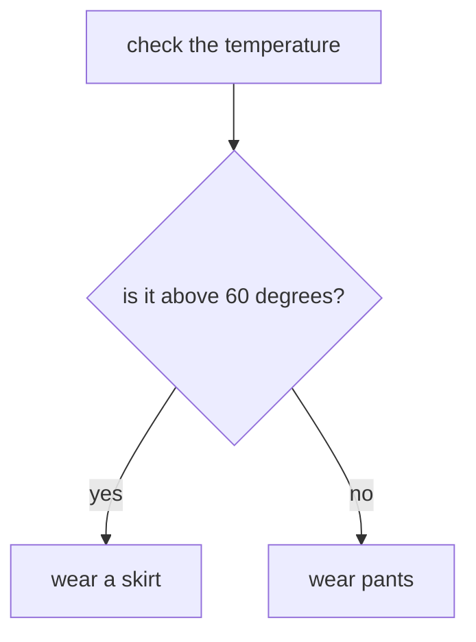
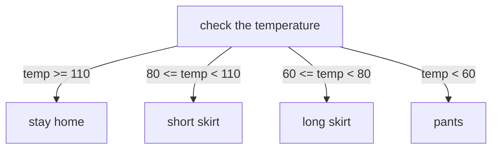

# Writing Your First Program
Welcome back! We're going to be working with [online-python.com](https://www.online-python.com/) again, so pop that link open in a new tab, and let's get started.

Go ahead and delete all that example code that's loaded by default -- we're blazing our own trail today. Alternatively, click the plus sign next to the `main.py` tab above the text editing area. This will start a new file.

# Hello, World!
There is a near-fifty-year tradition of beginning your programming venture with a program that does nothing but produce the output "Hello, world!" We jumped the gun last chapter and dove headfirst into something a bit more complicated, but it's never too late to honor our ancestors and perform this ceremony.

```python
print("Hello, world!")
```

As before and forever after, any time I show you code, type it out in your editor and run it. The *typing* part is an import part of building muscle memory, so don't copy and paste! 

As you've seen, this causes the words `"Hello, world!"` to appear on your screen. Specifically, in an area we call the console, or terminal. Just like how the name `print` hearkens back to mainframe computers physically printing onto paper, a *console* in those days referred to the [control center of those computers](https://unix.stackexchange.com/questions/545640/origin-of-the-word-console-in-computing). Those consoles were nothing but switches and blinking lights, but the name stuck around as hardware and software evolved. Nowadays, a console or terminal is a text-only interface to a computer or computer program. 

This might make you concerned. Text interfaces? What is this, the 80s? I get it! You want to make cool stuff, graphical stuff. Stuff you can show off to your friends and family to finally win their respect, and you really don't think text is going to cut it.

Here's the problem with that: programming a graphical interface immediately introduces a metric boat-load of complexity. Here's the simplest Hello World program that will display a window with the text "Hello World" in it.

```python
import gtk

class PyApp(gtk.Window):
   def __init__(self):
      super(PyApp, self).__init__()
      self.set_default_size(300,200)
      self.set_title("Hello World in PyGTK")
      label = gtk.Label("Hello World")
      self.add(label)
      self.show_all()
PyApp()
gtk.main()
```

In addition to using programming concepts we won't touch on until the very end of this course, in order to get this to actually run you would have to install a bunch of software on your computer and get it set up correctly. There's no online-python equivalent for graphical applications. 

That's the primary reason that you're starting with a text interface. But another significant reason is the simple fact that of all the software in the world, only the tiniest fraction of it involves communicating directly with a user, either graphically or by text. 

You'll see this in your own programs that you write throughout the course. As they get larger and more complex, the percentage of code that pertains to output and input will shrink dramatically. 

Speaking of your own programs, I suppose we should get back to learning to code. I hope you enjoy digressions, because this course is *filled* with them.

## Getting Back To It
Now that we've observed the "Hello World" tradition, we can start poking at it. Even a single line can teach us a lot.

If you recall from our whirlwind introduction in the last chapter, `print()` is an example of a function. A function is a reusable bit of code, but it doesn't have to be static and do the same thing each time we use (or *call*) it. A function can accept data in the form of function parameters, which are like "fill in the blank" spots where we provide the details when we call the function. 

These parameters go inside the parentheses after the function name. In this case, the parameter we're using is the string `"Hello, World!"` Strings are how we represent text that we actually want to treat as data, instead of commands to the programming language, and we use quotation marks to make it a string. If we were to leave off the quotation marks and try to run `print(Hello, World!)`, Python would assume we were trying to call the `print()` function with two arguments, the variables `Hello` and `World`. It would try to look up the definition of these variables, fail, and your program would crash with a `NameError`. (And the exclamation mark would cause an entirely different issue.)

There's a lot of information we can glean from poking at this like. For example, white space usually doesn't matter, except at the beginning of a line.

```python
print    (   "Hello, World!"     ) # works
 print("Hello, World!") # doesn't work
```

White space inside the string is literally displayed in the output. However, a line break causes an error. 

```python
print("Hello,         World!") # prints exactly that
print("Hello, 
	  World!") # doesn't work
```

You'll notice how the syntax highlighting (the coloring of the different parts of the program) breaks on the invalid example. That's another benefit to syntax highlighting, in that it can serve as an early warning system to point out mistakes.

If we want a line break in our output, we have two options. Triple quotes, which are like regular quotes except that they allow for line breaks, or the special character `\n`.

```python
print("""Hello,
World""") # any spaces at the beginning of the line appear literally in the output
print("Hello,\nWorld!")
```

`\n` is an example of an *escape character*. They're how we represent special things that aren't characters in the human understanding of the word, but that we still might want to have in a string. There's a number of them, but the new line one is the most common in general use, with the tab (`\t`) being the next most common.  

If you want to actually write a backslash without it being treated as a special character, you can escape it with another backslash or use a raw string. Raw strings are created by prepending a single lower-case letter `r` to the string, before the opening quotation mark. Raw strings mostly disable the special treatment of backslashes.

```python
print("\\n is a new line") 
print(r"\n is a new line")
# both lines will print: \n is a new line
```

You can also escape quotation marks in the same way.

```python
print("What kind of name is \"Crispin\", anyway?")
# prints: What kind of name is "Crispin", anyway?

```

## I'm "Very Able" To Teach You About Variables
Like we saw in Lesson 2, variables are names that we pick to represent values. 

```python
# some examples
favorite_number = 69
日本の首相 = "Fumio Kishida"
l337_speak_is_great = True
lak29ਕੋਲਇੱਕD2w = None
```

Almost any name works. The restrictions are:

* cannot start with a number
* cannot have spaces
* cannot have special characters other than the underscore (`_`)
	* this includes emojis 😔
* cannot be a Python keyword, like `True`, `def` or `import`
	* see the documentation for a [complete list](https://docs.python.org/3/reference/lexical_analysis.html#keywords)

As shown above, non-Latin alphabets *are* allowed.

## A Quick Break To Talk About Our Lord and Savior, the REPL
As you've been reading the last section and trying out all these different 1-line examples, you may have noticed that it's tedious to make a change, drag your mouse cursor to the run button, and click it. If you noticed the tooltip that appears when you hover the cursor over the button, you'll be hitting F8 instead of clicking -- easier, to be sure, but what if there was even a simpler way?

What if instead of a text editor, we could type a line of code, hit enter, and have it *immediately* executed and see the result? This concept is called the REPL -- the Read, Evaluate, and Print Loop. On online-python.com, you can access the REPL by clicking the button that looks like `>_` in a column to the left of the console (the area where output appears). 

Clicking this switches the console to a new mode. You'll see a `>>>` prompt -- now you can type any line of code, hit enter, and see the immediate results. And just like when using the text editor, you can create a variable like `x = 10`, and refer to it later, like `x + 59`. 

If you try that out, you'll see the most time-saving feature of the REPL -- you don't need `print()` to see the result! Instead, when python *evaluates* an expression, like `x + 59`, it just automatically prints that. You *can* use `print()`, but you don't have to. 

If you press the up arrow on your keyboard, it brings back the last thing you typed. Keep hitting up to keep going back in your history. The down arrow will go forward in the history.

REPLs are a fantastic tool in every programming language that supports them, and they're not just for beginners. In my everyday programming, I'm constantly using the REPL to quickly test ideas and validate my approach.

However, not all REPLs are built the same. online-python.com provides access to the basic, built-in python REPL. It's great, but you'll notice there's no syntax highlighting or auto-completion. For that, slide on over to [this website](https://www.pythonanywhere.com/try-ipython/) that provides access to the `iPython` terminal, which does the same thing, but makes it prettier and more user-friendly.

## Back To Variables
You can use variables in any place that would accept whatever thing the variable references.  Quick side note: now that I'm introduced the REPL, I usually won't be using `print()` in any short examples from now on. So remember that if you want to run these examples in the text editor, you'll need to use `print()` whenever you actually want to see output.

```python
a = 10
b = 3
# All of these are equivilent:
a / b 
10 / b 
a / 3 
10 / 3
```

You can redefine a variable at any time, including to a value of a different type:

```python
x = 10
x + 3 # 13
x = "cat"
x + "dog" # "catdog"
```

You can set variables equal to other variables:

```python
a = 5
b = a
a = 10
# if you're running this in the REPL, you can simply enter a variable name by itself to see the value
a # 10
b # 5
```

Note that setting `b = a` does not tie `b` to the value of `a` forever. It simply defines `b` to be whatever `a` was at that moment.

## Chapter 2 Was Way More Fun
Okay, you're right. This is pretty abstract. Let's introduce our control-flow statement: `if`. 

Programs can be visualized as flowcharts. Take the following flowchart, for example, that help you wear the right clothes based on the weather:


We're first getting our data, the temperature. Then we're comparing our data to a specific value. Depending on the result of this comparison, we either wear pants or a skirt. This is an example of *conditional logic*, where we choose between more than one action based upon some condition. The condition in this example is "the temperature is above 60 degrees". Or to express it more tersely using mathematical notation, we could say `temperature > 70`. That `>` is the *greater-than* symbol. As it happens, that's valid Python!

```python
temperature = 90
temperature > 60 # True
temperature < 60 # False
```

So how do you express the idea of only doing something *if* a condition is met? With an `if` statement, of course!

```python
temperature = 90

if temperature > 60:
	print("It's skirt wearing time!")
else:
	print("Pants are back on the menu, boys!")
```

We put the condition (`temperature > 60`) directly after the word `if`. Then there's a colon that ends the line. Then the next line is *indented*, in this case with four spaces, as is convention. Indentation is how python knows what's "inside" the `if` statement. If we didn't have indentation, how would python tell the difference between these two lines? 

```python
x = 10
if x < 20:
	print("Only print this if x is less than 20")
print("But always print this")
```

`else` can optionally be used after an `if` to serve as an alternative. The code inside the `else` is only executed if the condition from the `if` statement (`temperature > 60` in this case) evaluates to `False`.

Now, you may look at that first example and wonder how the else clause could *ever* get executed if we set `temperature` to 90. You're right, it couldn't. This is but a toy example; in the real world, the reason you're writing an `if` statement is because your data *does* vary. Perhaps it's being inputted by a user:

```python
temperature = int(input("Enter the temperature: "))

if temperature > 60:
	print("It's skirt wearing time!")
else:
	print("Pants are back on the menu, boys!")
```

## Beyond the Binary
But what it we want more than a binary yes/no choice? To continue with the above example, what if we consider multiple temperature ranges to decide our daily attire?


```python
temperature = int(input("Enter the temperature: "))

if temperature >= 110:
	print("Stay home, clothes optional")
elif 80 <= temperature < 110:
	print("Put the skate in skater skirt")
elif 60 <= temperature < 80:
	print("Maxi skirts are maximum style")
elif temperature < 60:
	print("Break out the pantaloons")
```

You'll notice the use of `>=` and `<=`, which as you might expect, represent "greater than or equal to" and "less than or equal to". When using comparisons, it's important to keep in mind whether the comparison is *inclusive* or *exclusive*. It's easy to introduce bugs -- in the above program, imagine only using `<` and `>`. Then if `temperature` was set to exactly `110`, `80`, or `60`, none of the conditions would be met.

You'll also note the use of *chained* comparisons, like `80 <= temperature < 110`. Another way of writing this is `80 <= temperature and temperature < 110`. I haven't formally introduced them yet, so this is a sneak peak: you can use `and` and `or` to chain together multiple conditions.

When using multiple if statements, we use `elif`, which is short for "else if". These accept a condition, and are identical in behavior to `if`.

Why use `elif`? Why not just use multiple `if`s? Well, consider the same program but using just `if`s.  Can you see what's wrong?

```python
temperature = int(input("Enter the temperature: "))

if temperature >= 110:
	print("Stay home, clothes optional")
if 80 <= temperature < 110:
	print("Put the skate in skater skirt")
if 60 <= temperature < 80:
	print("Maxi skirts are maximum style")
if temperature < 60:
	print("Break out the pantaloons")
```

You can't, don't worry -- that was a trick question. In this example, these conditions we're checking for are all mutually exclusive. There is no temperature that fits into more than one range. But let's say we wrote it slightly different....

```python
temperature = int(input("Enter the temperature: "))

if temperature >= 110:
	print("Stay home, clothes optional")
if temperature >= 80:
	print("Put the skate in skater skirt")
if temperature >= 60:
	print("Maxi skirts are maximum style")
if temperature < 60:
	print("Break out the pantaloons")
```

Now instead of confining `temperature` to a *range*, we're just making a single comparison. Now a temperature of 120, for example, fits all three of those first conditions. 120 is greater than 110, and it's greater than 80, and it's greater than 60. So that program would print out:

```
Stay home, clothes optional
Put the skate in skater skirt
Maxi skirts are maximum style
```

Changing those last three `if`s to `elif`s fixes that. (Try it!)

This also affects `else` statements. They only apply to the preceding `if/elif` chain. A way of thinking about `if`/`elif`/`else` is to consider them as a checklist. If I was writing a checklist on what to do if your car isn't working, I might write something like this:

* If your battery is dead, get a jump
* If your tires are flat, inflate them
* if you're out of gas, put more gas in the tank
* if none of the above works, buy a new car

A person with car troubles is going to read that, top to bottom, and stop on the first one that applies. For example, they know their battery isn't dead, so they won't try getting a jump. They look at their tires and realize that they're flat. They follow the instructions and inflate their tires. Then they crumple up this checklist and toss it in the trash, because they're done, their problem was solved. They didn't continue on to the third item, and they certainly didn't continue on the catch-all "none of the above" at the bottom.

## Equality is Pretty Great
The examples so far have all used comparisons, like `<` and `>=`. This is fantastic and all, but what if you wanted to, say, check that a value was *exactly* 69? You could write `68 < value < 70` which *works*, but that's silly. Let's use the equality operator!

```python
x = int(input("Enter a number"))
if x == 69:
	print("nice")
```

The *equality* operator is two equals signs back to back (`==`). Don't confuse it with the single equals (`=`), which is the *assignment* operator, and assigns a value to a variable.

Equality works with any data type -- try it out in the REPL. This is a good way to remind yourself that the *string* `"1"` is not the same thing as the *number* `1`.

```python
In [1]: "test" == "test"
Out[1]: True

In [2]: "test" == "post"
Out[2]: False

In [3]: "1" == 1
Out[3]: False
```

Similarly, there is the *not equals* operator, `!=`, that does exactly what it sounds like.

```python
In [4]: "test" != "test"
Out[4]: False

In [5]: "test" != "post"
Out[5]: True

In [6]: "1" != 1
Out[6]: True
```

## Code Can Go Anywhere
I want to hammer this point home, so there is no misunderstanding: there is no limit to what you can put inside an `if`, or -- more generally -- within an indented block of code. For example, we could take our first example and copy and paste the whole thing back into its `if`:

```python
temperature = int(input("Enter the temperature: "))

if temperature > 60:
	temperature = int(input("Enter the temperature: "))
	
	if temperature > 60:
		print("It's skirt wearing time!")
	else:
		print("Pants are back on the menu, boys!")
	print("It's skirt wearing time!")
else:
	print("Pants are back on the menu, boys!")
```

That doesn't make any sense for this example, but we can do it! An indented block of code is just code. Anything that could be written unindented, can be written indented.

## Recap
You learned a number of important concepts today. Here are the highlights:

* Whitespace in python usually doesn't matter, except at the beginning of a line
* A string is a text data
	* if you want a line break, use `\n` or triple quotes
	* if you want backslashes, use two (`\\`) or make it a raw string be prepending an `r` (`r"this is a raws string"`)
* variables are names that reference data
	* we assign data to a variable by using the equals sign (`date = 1984`)
	* we can pick almost any name we want, so long as there aren't any spaces or special characters
	* we can use a variable any place we could use the raw data, and vice versa
* you can use the REPL to immediately evaluate a single expression or line of code
* `if` statements can be used to conditionally control the flow of program execution. 
	* the conditional expression comes immediately after the keyword, and evaluates to either true or false
	* to chain together mutually exclusive conditions, use the `elif` keyword
		* `elif`s need a condition, just like `if`s
	* to optionally provide a fallback alternative if the conditions(s) doesn't apply, use the `else` keyword
		* `else` can appear after a single `if` or a chain of `if`/`elif`s
	`if`/`elif`/`else` end the line with a colon
	* all code that you want to be executed conditionally must be under that control-flow statement and indented

## Assignment, And One Final Lesson

You now have to tools needed to solve quite a wide range of problems! So let's solve this problem:

You are providing a service that matches customers with items in their price range. The user will enter their budget, and you'll suggest two items that are withing that range. Then the user will type the name of the item to purchase it. The actual products or services you provide are up to you, as is the exact output -- stretch your imagination. 

Here's an example session. Input from the user is preceded by `>>>` to separate it from the output.

```
Welcome to the Zoo! What's your budget?
>>> 500
You can buy a llama or a goat with that money.
>>> goat
Here's your goat! Thanks for visiting the zoo!
```

Take it slow and build it one step at time. Don't rush, and don't try to get fancy. The initial 1.0 version of your program should offer two price tiers and two items at each price tier. 

### Hints
Here's a hint, since I only briefly explained it in the previous lesson: when getting the budget, you need to use `int()`:

```python
budget = int(input("What's your budget?"))
# or, this does the same thing:
budget = input("What's your budget?")
budget = int(budget)
```

A string containing a number, like `"500"`, is not the same as the number `500`. When playing around in the REPL, you'll notice that when an expression evaluates to a string, it will have the quotation marks in the output. Integers will not.

```python  
In [8]: "1" + "1"
Out[8]: '11'

In [9]: 1 + 2
Out[9]: 3
```

You can use the function `type()` to make this explicit.

```python
In [10]: type("test post")
Out[10]: str

In [11]: type(3)
Out[11]: int
```

### Extra Credit (Not Actually Optional, Do It Or I Fail You)
Once you have your 1.0 version working, make it better.

* add rejection text if the user types something other than the item name
* add rejection text if the user types in a negative budget
* give the user something free if their budget is exactly zero.
* don't crash if the user enters something that's not a number
	* hint: if you scroll up a few lines, you'll see mention of the `type()` function. Can you use a function inside a conditional? Hrm... only one way to find out!

## Where To Go From Here
Take a break! Then work on the assignment, and don't try to do it all in one sitting. As your first full program, it's going to be slow-going. Look at the examples in this lesson and the previous ones for help -- the assignment requires nothing that hasn't been covered.

Once you have a working program and have at least attempted the extra credit, continue on to Lesson 4, where we'll start by dissecting this assignment, including the extra credit. So don't look at Lesson 4 too early, you don't want to spoil your fun!